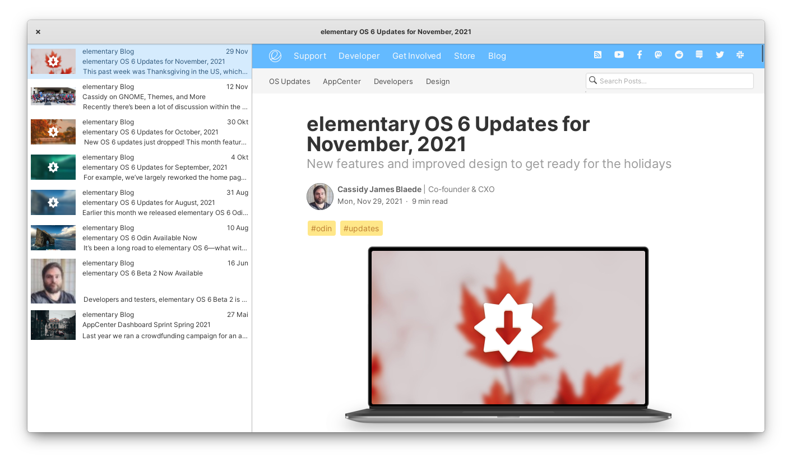
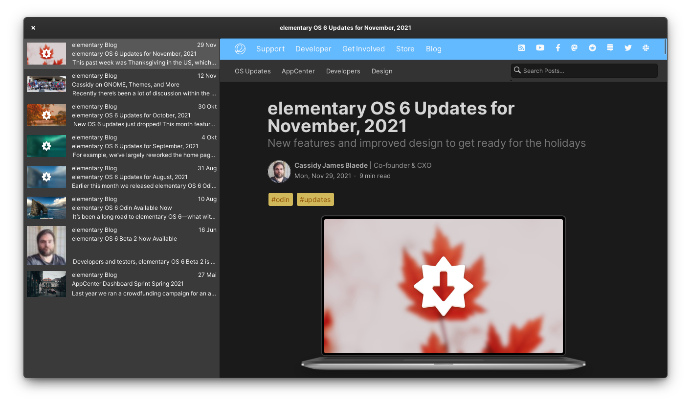

<div align="center">
  <span align="center"> </span>
  <h1 align="center">News Feed</h1>
  <h3 align="center">The best news sources, all in one place</h3>
  <p align="center">Designed for <a href="https://elementary.io">elementary OS</a></p>
</div>

<p align="center">
  <a href="https://appcenter.elementary.io/com.github.manexim.news" target="_blank">
    
  </a>
</p>

<p align="center">
  <a href="https://travis-ci.org/manexim/news">
    
  </a>
  <a href="https://github.com/manexim/news/releases/">
    
  </a>
  <a href="https://github.com/manexim/news/blob/master/COPYING">
    
  </a>
</p>

<p align="center">
  
  
</p>

## Installation

### Dependencies

These dependencies must be present before building:

-   `elementary-sdk`
-   `meson (>=0.40)`
-   `valac (>=0.40)`
-   `libgtk-3-dev`
-   `libgranite-dev`
-   `libsoup2.4-dev`
-   `libxml2-dev`
-   `libwebkit2gtk-4.0-dev`
-   `libgee-0.8-dev`

### Building

```
git clone https://github.com/manexim/news.git && cd news
meson build --prefix=/usr
cd build
ninja
sudo ninja install
com.github.manexim.news
```

### Deconstruct

```
sudo ninja uninstall
```

## Contributing

If you want to contribute to News Feed and make it better, your help is very welcome.

### How to make a clean pull request

-   Create a personal fork of this project on GitHub.
-   Clone the fork on your local machine. Your remote repo on GitHub is called `origin`.
-   Create a new branch to work on. Branch from `master`!
-   Implement/fix your feature.
-   Push your branch to your fork on GitHub, the remote `origin`.
-   From your fork open a pull request in the correct branch. Target the `master` branch!

And last but not least: Always write your commit messages in the present tense.
Your commit message should describe what the commit, when applied, does to the code – not what you did to the code.

## Special thanks

### Translators

| Name                                                | Language     |
| --------------------------------------------------- | ------------ |
| [NathanBnm](https://github.com/NathanBnm)           | French 🇫🇷     |
| [meisenzahl](https://github.com/meisenzahl)         | German 🇩🇪     |
| [capitantrueno](https://github.com/capitantrueno)   | Spanish 🇪🇸    |
| [rottenpants466](https://github.com/rottenpants466) | Portuguese 🇵🇹 |

## License

This project is licensed under the GNU General Public License v3.0 - see the [COPYING](COPYING) file for details.
